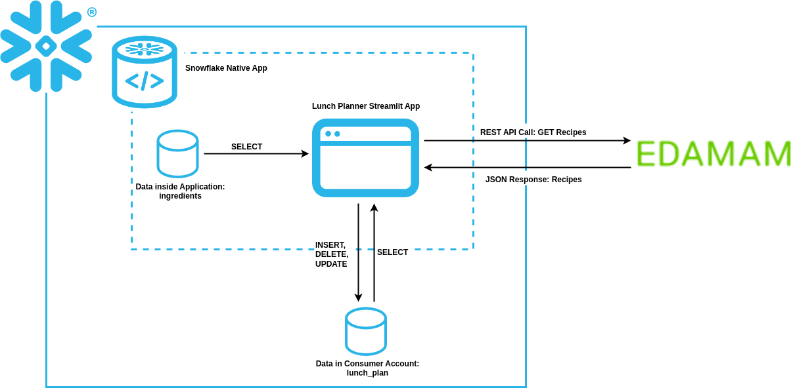
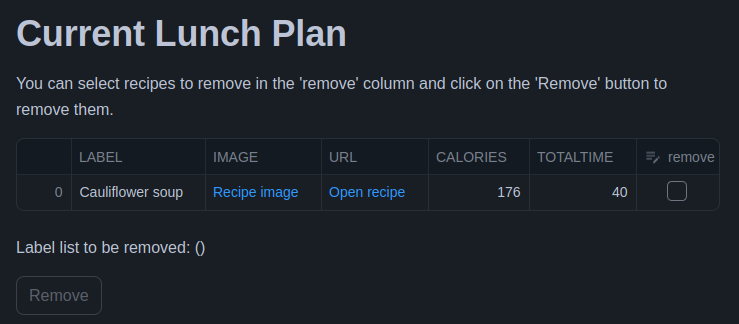

# Lunch Planner Demo Application

## Preliminaries
1) Required: Snowflake User with ACCOUNTADMIN role
    - Replace command in `scripts/01-prepare-app-package.sql` with your snoflake username
        ```
        GRANT ROLE IDENTIFIER($APP_DEV_ROLE) TO USER <YOUR_USERNAME>;
        ```
    - Replace in `.env.template` file the values for SNOWFLAKE_ACCOUNT, SNOWFLAKE_USER, SNOWFLAKE_PASSWORD (To get your Snowflake account name, navigate in Snowflake to your account logo on bottom left -> Account -> Your Account Name -> Click on copy account identifier. Replace "." with "-" in your account identifier)
        ```
        SNOWFLAKE_ACCOUNT=""ERUVBJC.INOVEX_PARTNER
        SNOWFLAKE_USER=""
        SNOWFLAKE_PASSWORD=""
        ```

2)  Create Application ID and Application Key for Recipe Search API of EDAMAM
    - Create a free account on EDAMAM website: https://www.edamam.com/
    - Navigate to: Accounts -> Edamam APIs -> Go to Dashboard -> Applications Tab
    - Create new application by clicking on: Create new application -> Recipe Search API
    - After creating a new applicaton navigate to: View -> Application ID,  Application Keys
    - Replace in the Python script `app/src/libraries/external_api.py` the `APP_ID` and `APP_KEY` string values with your Application ID and Application Key

        ```
        APP_ID  = "<YOUR_API_ID>"
        APP_KEY = "<YOUR_API_KEY>"
        ```

## Project Structure
- The file structure are represented below
- The files inside the `/app` directory will be uploaded into the `APPLICATIONCODE` stage and contains
    - `/scripts/setup_script.sql`: contains SQL statements that are run when the `CREATE APPLICATION` command is run (i.e. a consumer installs or upgrades a Snowflake Native App or a provider creates or upgrades an application object when testing an application package)
    - `/src`
        - `/libraries`: contains Python files with functions for third-party API calls
        - `/streamlit`: contains the Streamlit app Python file (with `environment.yml` file which defines the version of packages)
    - `manifest.yml`: Defines properties required by the application package (i.e. location of the setup script and version definitions)
- Files inside the `/scripts` directory are used for setting up the whole project (see [Project Setup](#project-setup))
```
/snowflake-native-apps-blog
    /app
        /scripts/
            setup_script.sql
        /src
            /libraries/
                external_api.py
                init.py
            /streamlit/
                environment.yml
                lunch_planner.py
        manifest.yml
    /scripts/
        01-prepare-app-package.sql
        02-install-app.sql
        03-link-data.sql
        99-cleanup.sql
        sf_upload.py
    .env.template
```

## Project Setup
1) Create a new SQL worksheet and execute all commands in `scripts/01-prepare-app-package.sql`
    - First the script ensures that the ACCOUNTADMIN role can create app packages
    - This script will create a role named `LUNCH_PLANNER_APP_DEVELOPER`
    - The role is granted to your Snowflake user
    - Additionally an APPLICATION PACKAGE named `LUNCH_PLANNER_PACKAGE` and a STAGE named `APPLICATIONCODE` is generated inside the `PUBLIC` schema of the APPLICATION PACKAGE
    - To the role `LUNCH_PLANNER_APP_DEVELOPER` different privileges are granted (create application on account, usage on warehouse `COMPUTE_WH`, ALL on APPLICATION PACKAGE `LUNCH_PLANNER_PACKAGE`, usage on `PUBLIC` schema of `LUNCH_PLANNER_PACKAGE` APPLICATION PACKAGE, write and read on stage `APPLICATIONCODE`)
    - Then inside the `shared_data` schema of the `LUNCH_PLANNER_PACKAGE` app package a table named `ingredients` is generated and some example entries are inserted into the table
    - Finally, usage on the `shared_data` schema and select on `ingredients` table privileges are granted to share in app package `LUNCH_PLANNER_PACKAGE`
2) After executing all commands in the first script, the Python script `sf_upload.py` needs to be executed (it is necessary to install all necessary Python packages in your environment with pip and the script should be executed in the root directory of the project)
    - The script will upload all files inside the `app` directory of the project into the `APPLICATIONCODE` stage of Snowflake
3) Create a new SQL worksheet and execute all commands in `scripts/02-install-app.sql`
    - The script creates NETWORK RULE and EXTERNAL ACCESS INTEGRATION which is necessary to call third party APIs inside the lunch planner application
    - The script creates also an APPLICATION named `LUNCH_PLANNER_APP` from the created app package `LUNCH_PLANNER_PACKAGE`
    - It creates also a table `lunch_plan` inside the `test_schema` of the `LUNCH_PLANNER_DB` database (The table simulates data inside a consumer account. Here for demontration and simplicity, the application and the consumer data are generated in the same Snowflake account) with a example entries.
    - Finally, usage privileges on `LUNCH_PLANNER_DB` database and `test_schema` are granted to role `LUNCH_PLANNER_APP_DEVELOPER`, also SELECT, INSERT, UPDATE and DELETE privileges on all tables in the `test_schema` are granted to the role and usage privilege on the created EXTERNAL ACCESS INTEGRATION are assigned to the role and also the application `LUNCH_PLANNER_APP`
4) Create a new SQL worksheet and execute all commands in `scripts/03-link-data.sql`
    - By executing this script the `init_app` procedure is executed which enables calling third-party APIs from the lunch planner application
    - It also calls the procedure `update_reference` which creates a reference to the `lunch_plan` table to enable access to data outside the application from the lunch planner app

### Remove all objects related to demo application
- To remove all objects related to the demo applications from your Snowflake account execute the script `99-cleanup.sql`

## Application

### Overview
- The image below visualizes the overall structure and data flow of the lunch planner application
- In the app, data stored inside the application package of the app are accessed, which contains different ingredients
- The accessed ingredients are shown in the lunch planner Streamlit app and the user can select ingredients to be excluded
- Using these selected ingredients as parameter, the [Recipe API of EDAMAM](https://developer.edamam.com/edamam-docs-recipe-api) can be called inside the app to get random recipe suggestions
- After getting the recipe suggestions, user can select recipes to be stored in the `recipe_plan` table existing inside a consumer account and outside the application package (user is also able to manage the recipe plan by deleting recipe entries in the `recipe_plan` table)



### Usage
- For using the lunch planner app in Snowflake choose the the `LUNCH_PLANNER_APP_DEVELOPER` role
- After opening the lunch planner application, On the top you can see your current lunch plan (initially contains one example recipe)
- You can remove here recipes by selecting recipes on the checkbox and by clicking on the 'Remove' button



- On the 'Recipe Suggestions' sections you can select first ingredients to be excluded from the suggestions by clicking on the checkbox (you can also edit the data and add your own ingredients to the row)
- After selcting ingredients to be excluded you can click on 'Get Recipes' button


- The recipe suggestions (without any selected ingredients) are shown in a data editor and you can select on the checkbox the recipes to be added to your current lunch plan
- After selecting the recipes from the recipe suggestions, you can click on 'Add selected recipes' button to add the recipes


- You can again see your updated lunch plan on the top section of the application

